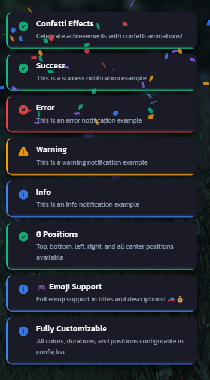

# RxNotify

A modern, feature-rich notification system for FiveM with confetti effects, 8 position options, and full customization. Built with Vue 3, Tailwind CSS, and designed for optimal performance.


## [Download](https://github.com/rxscripts/RxNotify/releases/latest/download/RxNotify.zip)

## ✨ Features
- **4 Notification Types**: Success, Error, Warning, Info with distinct colors and icons
- **8 Position Options**: Top-left, top-center, top-right, left-center, right-center, bottom-left, bottom-center, bottom-right
- **Confetti Effects**: Celebratory confetti animations for special moments
- **Custom Positioning**: Override default position per-notification
- **Default Titles**: Automatic titles when none provided (configurable)
- **Modern Design**: Dark slate theme with Kanit font and smooth animations
- **Position-Aware Animations**: Notifications slide from their screen positions
- **Progress Bar**: Visual timer that shrinks toward exit direction
- **Framework Integration**: Optional ESX, QBCore, and QBox integration
- **Emoji Support**: Full support for emojis in titles and text
- **Fully Customizable**: All colors, durations, and positions configurable

## ⚠️ Dependencies
None! RxNotify is standalone and framework-independent.

**Optional**: For framework integration, you can use ESX, QBCore, or QBox (files included in `[INSTALLATION]` folder)

## 🖥️ Installation
1. Download the latest release of `RxNotify`
2. Extract the zipped folder into your servers main `resources` directory
3. Add `ensure RxNotify` in your `server.cfg` file
4. *(Optional)* For framework integration, see the `[INSTALLATION]` folder README
5. Restart your server & enjoy!

### Framework Integration (Optional)
If you want RxNotify to replace your framework's default notifications:

#### ESX
1. Copy `[INSTALLATION]/ESX/rxnotify.lua` to your `es_extended` folder
2. Add `client_script 'rxnotify.lua'` at the **bottom** of `es_extended/fxmanifest.lua`
3. Restart your server

#### QBCore
1. Copy `[INSTALLATION]/QBCore/rxnotify.lua` to your `qb-core` folder
2. Add `client_script 'rxnotify.lua'` at the **bottom** of `qb-core/fxmanifest.lua`
3. Restart your server

#### QBox
1. Open `qbx_core/server/functions.lua`
2. Replace the `Notify` function with the code in `rxnotify_server.lua`
3. Open `qbx_core/client/functions.lua`
4. Replace the `Notify` function with the code in `rxnotify_client.lua`
5. Restart your server

## 📚 Documentation
Full documentation available at: [RX Scripts Docs](https://docs.rxscripts.xyz/scripts/free/notify-system/installation)

### Client Exports
```lua
exports['RxNotify']:Notify(title, text, type, length, options)
```

**Parameters:**
- `title` (string): Notification title (nil for default title)
- `text` (string): Message text
- `type` (string): 'success', 'error', 'warn', or 'info' (default: 'info')
- `length` (number): Duration in milliseconds (default: 3000)
- `options` (table): Optional settings
  - `confetti` (boolean): Trigger confetti effect
  - `position` (string): Override default position ('tl', 'tc', 'tr', 'lc', 'rc', 'bl', 'bc', 'br')

**Examples:**
```lua
-- Basic notification
exports['RxNotify']:Notify("Success", "Action completed!", "success")

-- With confetti
exports['RxNotify']:Notify("Achievement!", "You did it!", "success", 5000, { confetti = true })

-- Custom position
exports['RxNotify']:Notify("Alert", "Check here!", "info", 4000, { position = 'tr' })

-- Confetti + position
exports['RxNotify']:Notify("Party!", "Celebration!", "success", 6000, {
    confetti = true,
    position = 'tc'
})
```

### Server Events
```lua
TriggerClientEvent('RxNotify:Notify', source, title, text, type, length, options)
```

## 🎨 Configuration
All settings are in `config.lua`:
- Default position (8 options)
- Default duration
- Default titles per type
- Full color customization (background, text, accent colors)

## ℹ️ Support
If you have any suggestions for new features, discovered a bug or having a problem with the script, feel free to contact us at anytime via:
* [Discord](https://discord.gg/rxscripts)

## ⭐ Take a look at our other products!
### General
* [Advanced Housing](https://store.rxscripts.xyz/scripts/advanced-housing?utm_source=github&utm_medium=free-script)
* [Advanced Banking](https://store.rxscripts.xyz/scripts/advanced-banking?utm_source=github&utm_medium=free-script)
* [Advanced Garages](https://store.rxscripts.xyz/scripts/advanced-garages?utm_source=github&utm_medium=free-script)
* [Advanced Reports](https://store.rxscripts.xyz/scripts/advanced-reports?utm_source=github&utm_medium=free-script)
* [Black Markets](https://store.rxscripts.xyz/scripts/black-markets?utm_source=github&utm_medium=free-script)
* [Loading Screen](https://store.rxscripts.xyz/scripts/loading-screen?utm_source=github&utm_medium=free-script)
* [Gang Wars](https://store.rxscripts.xyz/scripts/gang-wars?utm_source=github&utm_medium=free-script)
### Activities
* [Advanced Hunting](https://store.rxscripts.xyz/scripts/advanced-hunting?utm_source=github&utm_medium=free-script)
* [Advanced Mining](https://store.rxscripts.xyz/scripts/advanced-mining?utm_source=github&utm_medium=free-script)
* [Advanced Fishing](https://store.rxscripts.xyz/scripts/advanced-fishing?utm_source=github&utm_medium=free-script)
* [Advanced Drug Labs](https://store.rxscripts.xyz/scripts/advanced-drug-labs?utm_source=github&utm_medium=free-script)
* [Advanced Plantation](https://store.rxscripts.xyz/scripts/advanced-plantation?utm_source=github&utm_medium=free-script)
* [Advanced Player Stores](https://store.rxscripts.xyz/scripts/advanced-player-stores?utm_source=github&utm_medium=free-script)
### Survival
* [Recyclers](https://store.rxscripts.xyz/scripts/recyclers?utm_source=github&utm_medium=free-script)
* [Smelters](https://store.rxscripts.xyz/scripts/smelters?utm_source=github&utm_medium=free-script)
* [Crates & Storages](https://store.rxscripts.xyz/scripts/crates-storages?utm_source=github&utm_medium=free-script)
* [Death System](https://store.rxscripts.xyz/scripts/death-system?utm_source=github&utm_medium=free-script)
* [Hazard Zones](https://store.rxscripts.xyz/scripts/hazard-zones?utm_source=github&utm_medium=free-script)
* [Chopshop](https://store.rxscripts.xyz/scripts/chopshop?utm_source=github&utm_medium=free-script)

## Previews

